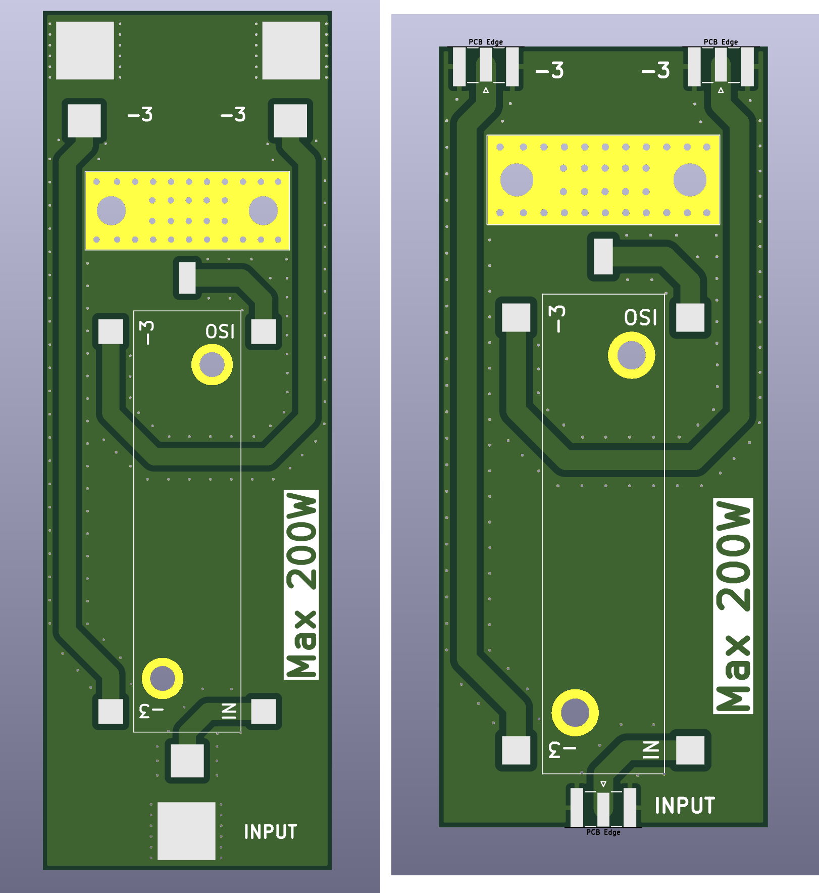
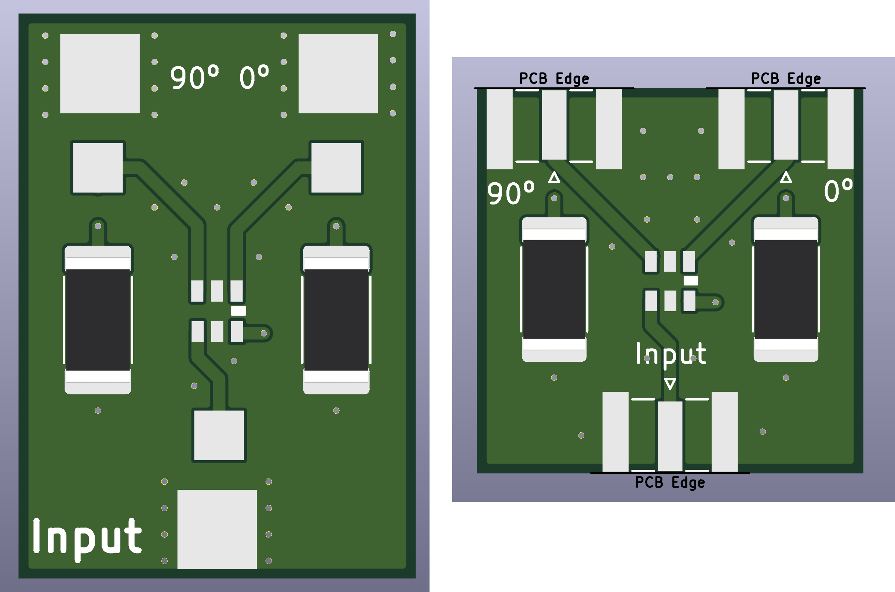

# Hybrid coupler boards for making circular polarization

This repo consists of different boards that use different devices to get [circular polarized](https://satcomradio.github.io/#/antennas/polarization) antennas. 

#### Please make sure to visit the [satcom radio website](https://satcomradio.github.io/) for more information


All the PCB boards have a version that where you can use SMA connectors or soldered wires.  
If you want to use the SMA connector boards, you will need to buy:

```
3x SMA connectors for PCB with 1.6mm spacing (aliexpress.com/item/10000000835065.html)

```

Important!

You must connect them correctly! Each port has to be a "dipole".  
Depending on their orientation you will get RHCP or LHCP.


------

## Ordering the PCB:

Download the Gerber file you want from this repo and order it a jlcpcb with the default options.  
The only option I've changed is to remove the manufacture code mark


------

## CMX03A03:

- [SMA version](./GERBER-CmxSma.zip)  
- [Soldered wires version](./GERBER-CmxRf.zip)

Most compact option for high power. Can handle 200W


### BOM:

```
1x CMX03A03 (aliexpress.com/item/1005008506296292.html)
1x G150N 50 ohm RF load (aliexpress.com/item/32909755238.html)

```
----

## RF Power:

- [SMA version](./GERBER-RfPowerSma.zip)  
- [Soldered wires version](./GERBER-RfPowerRf.zip)

Can handle 200W.  
There's few information about this coupler but it's usually sold with a 50 ohm resistance for free.



### BOM:

```
1x RF Power coupler (aliexpress.com/item/32886665884.html?)

This resistance is often given for free when you buy the coupler:
1x RF 32-7001 50 ohm RF load (aliexpress.com/i/1005006266356008.html)

```
----

## Anaren 10260-3:

- [SMA version](./GERBER-AnarenSma.zip)  
- [Soldered wires version](./GERBER-AnarenRf.zip)

Can handle 250W.  
Outdated so it's difficult to find. Usually it's sold on ebay.


### BOM:

```
1x Anaren 10260-3
1x G150N 50 ohm RF load (aliexpress.com/item/32909755238.html)

```
----

## QCN3:

- [SMA version](./GERBER-CmxSma.zip)  
- [Soldered wires version](./GERBER-Qcn3Rf.zip)

Most compact option. Can handle 15W.  
Very compact. To be used only with handheld radios.



### BOM:

```
1x QCN-3 (aliexpress.com/item/1005002788551103.html)
2x SMD resistor 2512 100Ω 2W resistor (https://es.aliexpress.com/item/1005007255020731.html)

```
----